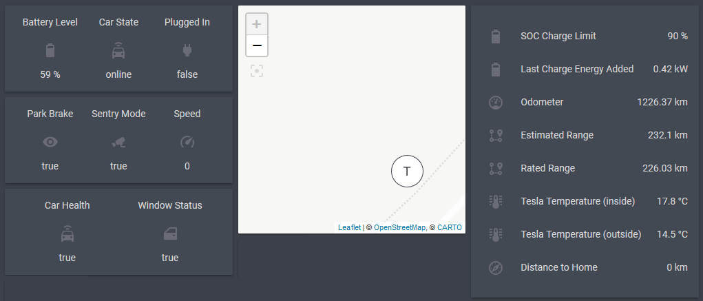

# HomeAssistant Integration

## Introduction

Whilst HomeAssistant provides an official component for Tesla vehicles, the component has not been updated recently, and does not have the sophistication of TeslaMate's polling mechanism, resulting in the component's default values keeping the vehicle awake and draining the battery.

The ultimate goal of this guide is to consume as much of the TeslaMate polling data as possible to replace the majority of the official Tesla component's polling functionality.

If your intention is to only use read-only sensor values, those provided by TeslaMate via MQTT are sufficient, and you do not need to utilise the official Tesla component. If however you would like to be able to write values to the Tesla API (Lock/Unlock Doors or automate Climate), there is a solution which involves configuring an extremely high polling interval for the Tesla component and using automation to populate the values from the TeslaMate MQTT parameters.

## Screenshots



## Current Status

- Sensors: All sensors exposed by the Tesla component are available
- Locks: Not implemented
- Climate: Not implemented

## Configuration

### automation.yaml

The following provides an automation to update the location of the `device_tracker.tesla_location` tracker when new lat/lon values are published to MQTT. You can use this to:

- Plot the location of your Tesla on a map (see the _ui-lovelace.yaml_ file for an example of this)
- Calculate the proximity of your Tesla to another location such as home (see _configuration.yaml_, below)

```YAML
- alias: Update Tesla location as MQTT location updates
  initial_state: on
  trigger:
    - platform: mqtt
      topic: teslamate/cars/1/latitude
    - platform: mqtt
      topic: teslamate/cars/1/longitude
  action:
    - service: device_tracker.see
      data_template:
        dev_id: tesla_location
        location_name: not_home
        gps: [ '{{ states.sensor.tesla_latitude.state }}', '{{ states.sensor.tesla_longitude.state }}' ]
```

### configuration.yaml

Proximity sensors allow us to calculate the proximity of the Tesla `device_tracker` to defined zones. This can be useful for:

- Automatic Garage Door opening when you arrive home
- Notifications when the vehicle is arriving

```YAML
automation: !include automation.yaml

proximity:
  home_tesla:
    zone: home
    devices:
      - device_tracker.tesla_location
    tolerance: 10
    unit_of_measurement: km

tesla:
  username: !secret tesla_username
  password: !secret tesla_password
  scan_interval: 3600

sensor: !include sensor.yaml
```

### known_devices.yaml (define a tracker for Tesla)

This is required for the automation above (in the _automation.yaml_ section). It defines the device_tracker object that we use to represent the location of your Tesla vehicle.

```YAML
tesla_location:
  hide_if_away: false
  icon: mdi:car
  mac:
  name: Tesla
  picture:
  track: true
```

### sensor.yaml (sensor: section of configuration.yaml)

```YAML
- platform: mqtt
  name: tesla_battery_level
  state_topic: "teslamate/cars/1/battery_level"
  unit_of_measurement: '%'
  icon: mdi:battery-80

- platform: mqtt
  name: tesla_charge_energy_added
  state_topic: "teslamate/cars/1/charge_energy_added"
  unit_of_measurement: 'kW'
  icon: mdi:battery-80

- platform: mqtt
  name: tesla_charge_limit
  state_topic: "teslamate/cars/1/charge_limit_soc"
  unit_of_measurement: '%'
  icon: mdi:battery-80

- platform: mqtt
  name: tesla_charge_port_door_open
  state_topic: "teslamate/cars/1/charge_port_door_open"
  icon: mdi:car-door

- platform: mqtt
  name: tesla_charger_actual_current
  state_topic: "teslamate/cars/1/charger_actual_current"
  unit_of_measurement: 'A'
  icon: mdi:battery-80

- platform: mqtt
  name: tesla_charger_phases
  state_topic: "teslamate/cars/1/charger_phases"
  icon: mdi:power-plug

- platform: mqtt
  name: tesla_charger_power
  state_topic: "teslamate/cars/1/charger_power"
  unit_of_measurement: 'W'
  icon: mdi:power-plug

- platform: mqtt
  name: tesla_charger_voltage
  state_topic: "teslamate/cars/1/charger_voltage"
  unit_of_measurement: 'V'
  icon: mdi:gauge

- platform: mqtt
  name: tesla_display_name
  state_topic: "teslamate/cars/1/display_name"
  icon: mdi:car

- platform: mqtt
  name: tesla_estimated_range
  state_topic: "teslamate/cars/1/est_battery_range_km"
  unit_of_measurement: 'km'
  icon: mdi:map-marker-path

- platform: mqtt
  name: tesla_healthy
  state_topic: "teslamate/cars/1/healthy"
  icon: mdi:car-connected

- platform: mqtt
  name: tesla_ideal_range
  state_topic: "teslamate/cars/1/ideal_battery_range_km"
  unit_of_measurement: 'km'
  icon: mdi:map-marker-path

- platform: mqtt
  name: tesla_inside_temp
  state_topic: "teslamate/cars/1/inside_temp"
  unit_of_measurement: °C
  icon: mdi:thermometer-lines

- platform: mqtt
  name: tesla_latitude
  state_topic: "teslamate/cars/1/latitude"
  icon: mdi:crosshairs-gps

- platform: mqtt
  name: tesla_locked
  state_topic: "teslamate/cars/1/locked"
  icon: mdi:lock

- platform: mqtt
  name: tesla_longitude
  state_topic: "teslamate/cars/1/longitude"
  icon: mdi:crosshairs-gps

- platform: mqtt
  name: tesla_odometer
  state_topic: "teslamate/cars/1/odometer"
  unit_of_measurement: km
  icon: mdi:gauge

- platform: mqtt
  name: tesla_outside_temp
  state_topic: "teslamate/cars/1/outside_temp"
  unit_of_measurement: °C
  icon: mdi:thermometer-lines

- platform: template
  sensors:
    tesla_park_brake:
      friendly_name: Park Brake
      value_template: >-
        
          true
        
          false
        

- platform: mqtt
  name: tesla_plugged_in
  state_topic: "teslamate/cars/1/plugged_in"
  icon: mdi:power-plug

- platform: mqtt
  name: tesla_rated_range
  state_topic: "teslamate/cars/1/rated_battery_range_km"
  unit_of_measurement: 'km'
  icon: mdi:map-marker-path

- platform: mqtt
  name: tesla_scheduled_charging_start
  state_topic: "teslamate/cars/1/scheduled_charging_start_time"
  icon: mdi:clock-outline

- platform: mqtt
  name: tesla_sentry_mode
  state_topic: "teslamate/cars/1/sentry_mode"
  icon: mdi:cctv

- platform: mqtt
  name: tesla_shift_state
  state_topic: "teslamate/cars/1/shift_state"
  icon: mdi:car-shift-pattern

- platform: mqtt
  name: tesla_speed
  state_topic: "teslamate/cars/1/speed"
  icon: mdi:speedometer

- platform: mqtt
  name: tesla_state
  state_topic: "teslamate/cars/1/state"
  icon: mdi:car-connected

- platform: mqtt
  name: tesla_time_to_full_charge
  state_topic: "teslamate/cars/1/time_to_full_charge"
  icon: mdi:clock-outline

- platform: mqtt
  name: tesla_windows_open
  state_topic: "teslamate/cars/1/windows_open"
  icon: mdi:car-door

- platform: mqtt
  name: tesla_version
  state_topic: "teslamate/cars/1/version"
  icon: mdi:alphabetical

- platform: mqtt
  name: tesla_update_available
  state_topic: "teslamate/cars/1/update_available"
  icon: mdi:gift

```

### ui-lovelace.yaml

The below is the Lovelace UI configuration used to make the example screenshot above. You will obviously want to configure this to your liking, however the example contains all of the sensors and values presented via MQTT and could be used as the basis of UI configuration.

```YAML
  - path: car
    title: Car
    badges: []
    icon: 'mdi:car-connected'
    cards:
      - type: vertical-stack
        cards:
          - type: glance
            entities:
              - entity: sensor.tesla_battery_level
                name: Battery Level
              - entity: sensor.tesla_state
                name: Car State
              - entity: sensor.tesla_plugged_in
                name: Plugged In
          - type: glance
            entities:
              - entity: sensor.tesla_park_brake
                name: Park Brake
              - entity: sensor.tesla_sentry_mode
                name: Sentry Mode
              - entity: sensor.tesla_speed
                name: Speed
          - type: glance
            entities:
              - entity: sensor.tesla_healthy
                name: Car Health
              - entity: sensor.tesla_windows_open
                name: Window Status
          - type: horizontal-stack
            cards:
              - type: 'custom:button-card'
                entity: sensor.tesla_locked
                name: Charger Door
                show_state: true
                state:
                  - value: locked
                    icon: 'mdi:lock'
                    color: green
                    tap_action:
                      action: call-service
                      service: lock.unlock
                      service_data:
                        entity_id: lock.tesla_model_3_charger_door_lock
                  - value: unlocked
                    icon: 'mdi:lock-open'
                    color: red
                    tap_action:
                      action: call-service
                      service: lock.lock
                      service_data:
                        entity_id: lock.tesla_model_3_charger_door_lock
              - type: 'custom:button-card'
                entity: lock.tesla_door_lock
                name: Car Door
                show_state: true
                state:
                  - value: locked
                    icon: 'mdi:lock'
                    color: green
                    tap_action:
                      action: call-service
                      service: lock.unlock
                      service_data:
                        entity_id: lock.tesla_model_3_door_lock
                  - value: unlocked
                    icon: 'mdi:lock-open'
                    color: red
                    tap_action:
                      action: call-service
                      service: lock.lock
                      service_data:
                        entity_id: lock.tesla_model_3_door_lock
      - type: vertical-stack
        cards:
          - type: map
            entities:
              - device_tracker.tesla_location
          - type: thermostat
            entity: climate.tesla_model_3_hvac_climate_system
      - type: entities
        entities:
          - entity: sensor.tesla_charge_limit
            name: SOC Charge Limit
          - entity: sensor.tesla_charge_energy_added
            name: Last Charge Energy Added
          - entity: sensor.tesla_odometer
            name: Odometer
          - entity: sensor.tesla_estimated_range
            name: Estimated Range
          - entity: sensor.tesla_rated_range
            name: Rated Range
          - entity: sensor.tesla_inside_temp
            name: Tesla Temperature (inside)
          - entity: sensor.tesla_outside_temp
            name: Tesla Temperature (outside)
          - entity: proximity.home_tesla
            name: Distance to Home
```
